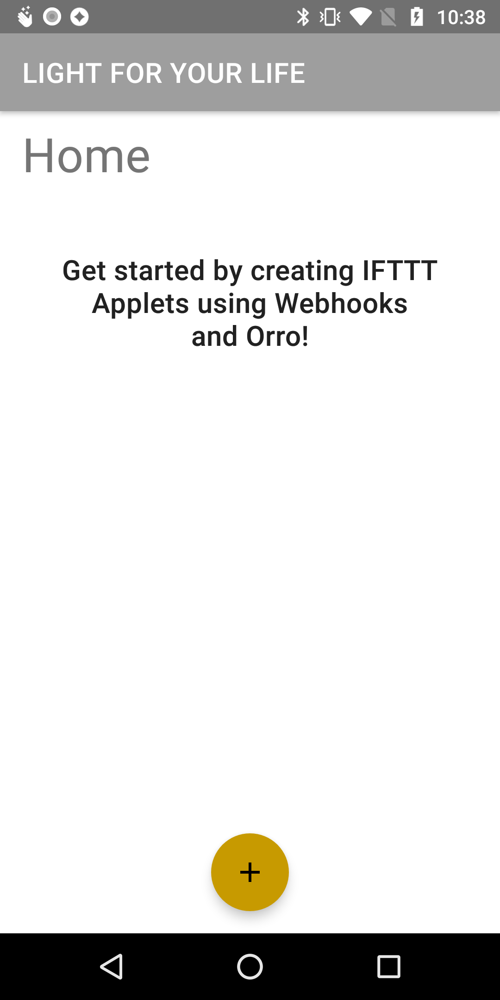
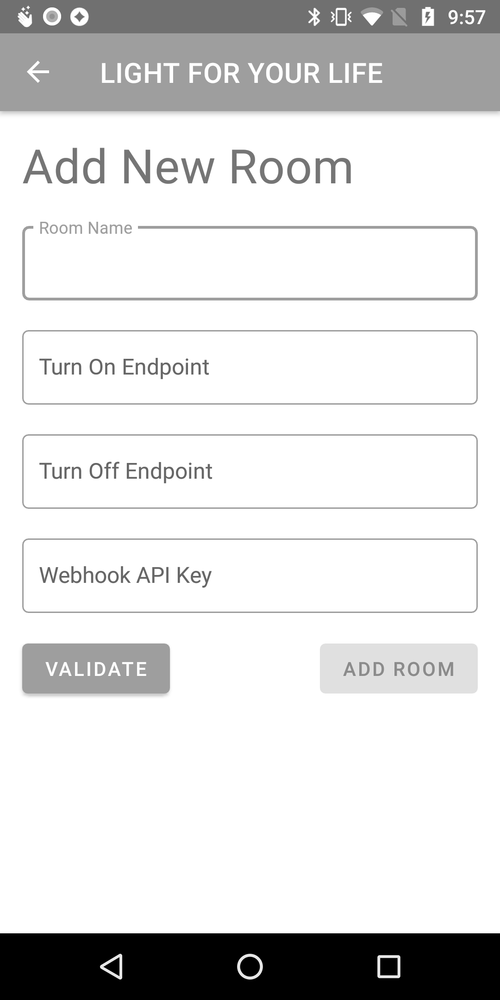
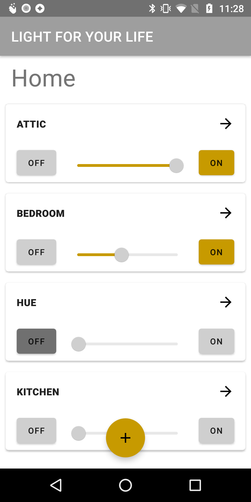
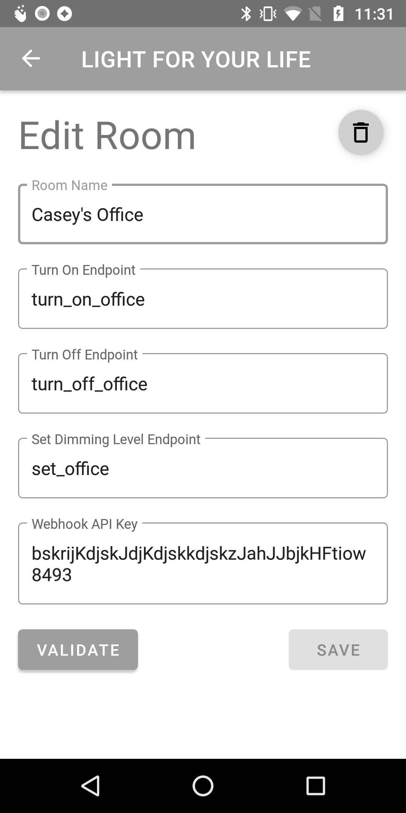

# OrrIFTTT

## Overview
The app allows users to control all of their smart lights (across multiple vendors and accounts), all from one app. The app does require minimal setup of IFTTT to get started, but once setup, provides a simple and intuitive user interface to control the lights. Below are some screenshots of the various app pages.

     
    
      
  

## Setup

### Configure IFTTT Services
1. Create an IFTTT account [here](https://ifttt.com)
2. Add the Webhooks Service by navigating to their [page](https://ifttt.com/maker_webhooks) and selecting "Connect"
3. After successfully setting up Webhooks, you should now see a "Documentation" Button. Clicking that reveals a page with you Webhook API Key. Save this page for future use.
4. Add the [Orro Service](https://ifttt.com/orro) (or other services), select "Connect", and sign in with your account.

### Create Applets
For each switch, you need to make 3 applets, 1 for on, 1 for off, and 1 to set a specific dimming level. The steps below can be repeated for each applet.
1. Navigate to the IFTTT create page [here](https://ifttt.com/create)
2. Click "+ This"
3. Search for and select "Webhooks"
4. Choose "Receive a web request" as trigger
5. Enter an event name signifying action and switch, and "Create Trigger". This will be needed later. For example "turn_on_living_room"
6. Click "+ That"
7. Search for and select "Orro", "Hue", or other compatible lighting services
8. Select the appropriate action (Turn ON, Turn OFF, or SET)
9. Select which of your switches it should control 
    * When doing SET, click the "Add Ingredient" button and select "Value1"
10. Select "Create Action"
11. Review your event and select "Finish"
12. Optional: You can test your new event from the Webhooks Documentation page and ensure it performs the desired action

## Add Rooms
Once you have created 3 applets (for turn on, turn off, and set level of a switch), you can use the event names and the webhook api key to add the control to the OrrIFTTT App!

1. On the home page of the OrrIFTTT app, tap the "+" icon on the bottom of the screen.
2. Enter a room name, e.g. "Living Room"
3. Enter the event name for the turn on action you previously created, e.g. "turn_on_living_room"
4. Enter the event name for the turn off action you previously created, e.g. "turn_off_living_room"
4. Enter the event name for the set action you previously created, e.g. "set_living_room"
5. Enter the Webhooks API Key from the webhooks documentation page. (Don't worry, you only have to enter this the first time. Will be saved and autopopulated for other rooms).
6. Select "Validate". This will ensure the Webhok API Key you entered is valid. If so, the "Add Room" button will be enabled
7. Select "Add Room". The room should now be added to the home page, and the On and Off buttons should control the light!

