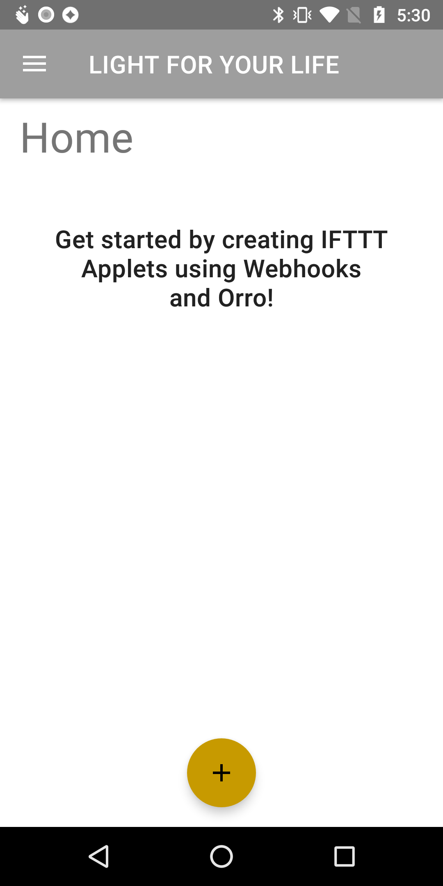

# Spark Director

## Overview
Spark Director creates a centralized home for your smart lighting controls, providing a common interface no matter the brand (although Orro is our favorite!).

     
    
      
  

More details can be found on the app [website](http://caseytmorris.com/sparkdirector).

## Setup

Step by step instructions to set up the IFTTT applets with Webhooks and a light control like Orro can be found on the [Spark Director](http://caseytmorris.com/sparkdirector/setup) site as well.

